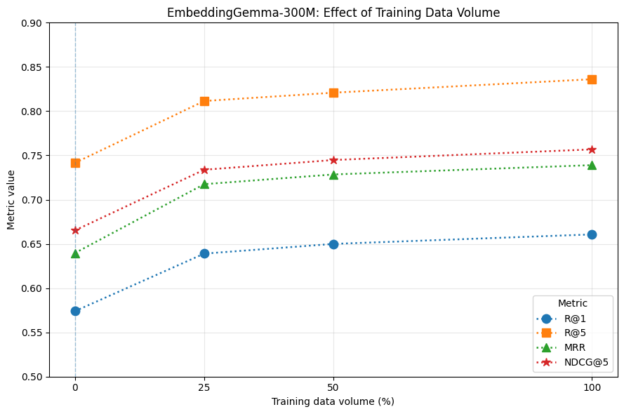
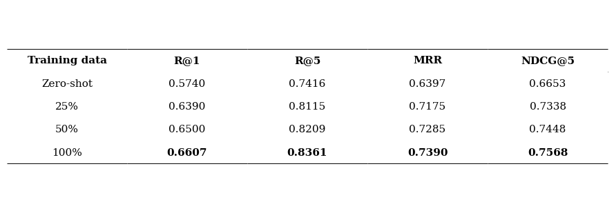

# Experimental Results

This directory contains experimental results used in the NIR
on benchmarking generative software development for the low-resource
ArkTS programming language.

## Directory structure

### `raw/`

Raw JSON records of individual experiments and results reported
in the ArkTS-CodeSearch paper.

Files:

- `baseline_embeddinggemma.json` — zero-shot EmbeddingGemma-300M baseline.
- `fine_tuning_25.json` — fine-tuning with 25% of the ArkTS training data.
- `fine_tuning_50.json` — fine-tuning with 50% of the ArkTS training data.
- `fine_tuning_100.json` — fine-tuning with 100% of the ArkTS training data.
- `paper_table1.json` — results reported in Table 1 of the ArkTS-CodeSearch paper.
- `paper_table2.json` — results reported in Table 2 of the ArkTS-CodeSearch paper.

## Evaluation task

The benchmark evaluates docstring-to-function retrieval.

The test set contains 2,446 examples.

The main evaluation metrics are:

- Recall@1
- Recall@5
- MRR
- NDCG@5

## Controlled data-efficiency experiment

The 25%, 50%, and 100% experiments use the same model and
training configuration. The intended experimental variable is
the fraction of specialized ArkTS training data.

## Main results

The main independent NIR experiment evaluates the effect of
ArkTS-specific training data volume on EmbeddingGemma-300M.

The zero-shot result is used as a baseline, while the fine-tuned
models are trained using 25%, 50%, and 100% of the ArkTS training data.

### Data-efficiency curve

The results show a consistent increase in all four retrieval metrics
as the amount of specialized ArkTS training data increases.

### Exact metric values

| Training data | R@1 | R@5 | MRR | NDCG@5 |
|---|---:|---:|---:|---:|
| Zero-shot | 0.5740 | 0.7416 | 0.6397 | 0.6653 |
| 25% | 0.6390 | 0.8115 | 0.7175 | 0.7338 |
| 50% | 0.6500 | 0.8209 | 0.7285 | 0.7448 |
| 100% | 0.6607 | 0.8361 | 0.7390 | 0.7568 |

The corresponding rendered table is available as:

## Results from the joint paper

The following figures visualize results reported in the joint
ArkTS-CodeSearch paper. They are included for contextual comparison
and are not part of the independent controlled NIR experiment.

### Model comparison

### TypeScript-to-ArkTS transfer

## Attribution

The `fine_tuning_25.json`, `fine_tuning_50.json`, and
`fine_tuning_100.json` files contain experiments conducted
as part of this NIR.

The `paper_table1.json` and `paper_table2.json` files contain
results reported in the joint ArkTS-CodeSearch paper and are
stored separately from the independent NIR experiments.
